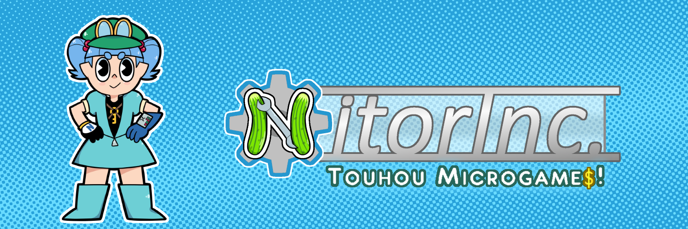

[Twitter](http://twitter.com/nitorinc) 
[Tumblr](http://nitorinc.tumblr.com/) 
[Public Discord Server](https://discord.gg/Fua4bgj)

# About 

NitorInc.: Touhou Microgames is a collaborative WarioWare-style Touhou fangame. Creators of all skillsets are welcome to help make microgames! If you want to contribute in any department, it would be best if you joined our Discord (link above), or you can contact us on social media or at nitorincmicrogames@gmail.com

# Contributing

If you want to be part of the collab and work on your own microgame, sign up [right here](http://bit.do/nitorinccollab)! Programmers, artists, musicians, and localizers are wanted to help us put these games together! If programming is your thing, then you should know this project is made using the [Unity engine](https://unity3d.com/get-unity/download). Other types of contributions outside the collab are welcome in certain areas. Again, the best way to find out is to join our Discord, or just message us if you think you have anything else to contribute.
